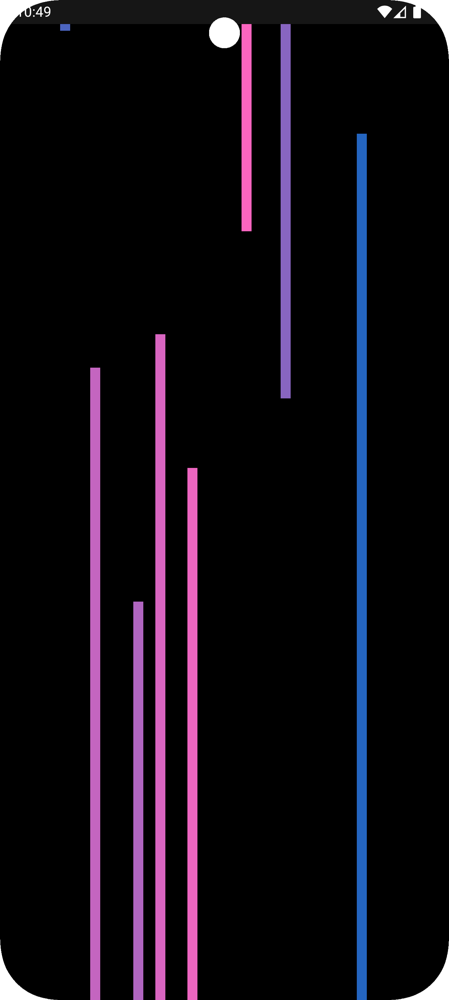
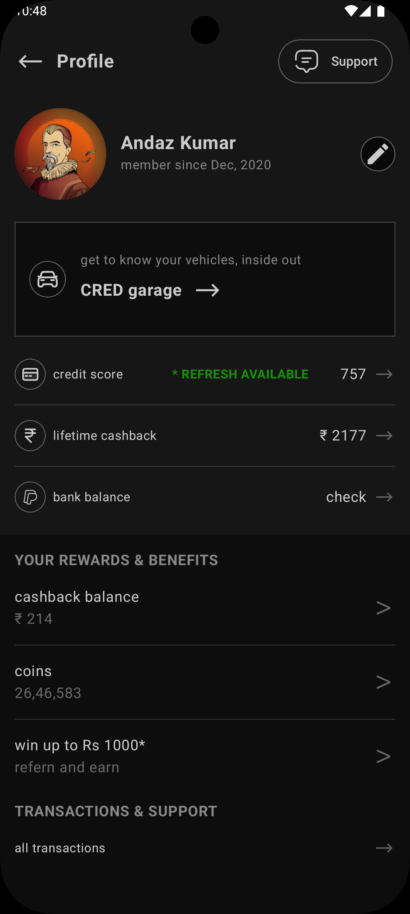

# Profile App

Welcome to the Profile App, a sleek and modern Android application built using Jetpack Compose. This app features a visually stunning splash screen with animated falling lines, followed by a user profile screen that displays personal information, rewards, and transactions in a clean and organized layout. The app fetches user data from Firebase and ensures a seamless user experience with smooth animations and a dark theme.

---

## ✨ Features

- 🔵 **Stunning Splash Screen**: A beautiful splash screen with animated falling blue lines and a glowing effect, fading out smoothly to transition to the profile screen.
- 👤 **Profile Screen**: Displays user information such as name, member since date, credit score, lifetime cashback, bank balance, and rewards like cashback balance and coins.
- 🔥 **Firebase Integration**: Fetches user data in real-time from Firebase Realtime Database.
- 🎞️ **Smooth Animations**: Includes fade-in and fade-out transitions between the splash and profile screens, with a black background for a seamless experience.
- 📱 **Responsive Design**: Fully scrollable profile screen to ensure all content is accessible on smaller screens.
- 🌙 **Dark Theme**: A visually appealing dark theme with off-white text and subtle color accents for better readability.

---

## 📷 Screenshots

### Logo

> The Profile App logo, showcasing a minimalist design with a focus on user profiles.

### Splash Screen and Profile Screen

  
  

> The splash screen with animated falling lines (left) transitions to the profile screen (right), displaying user data and rewards.

---

## 🎥 Demo Video

> 📹 A quick demo of the Profile App, highlighting the splash screen animation and profile screen navigation.

[▶️ Watch Demo Video on Google Drive](https://drive.google.com/file/d/1UN--Mwl_zvWORJOg6DkrBNkLBWH2HbYh/view?usp=drive_link)

---

## 📦 Download

Download the latest APK here:

[📱 Download APK](./apk.apk)

---

## 🧑‍💻 Usage

- **Splash Screen**: Displays on app launch with animated falling lines and fades out after 2 seconds.
- **Product Detail Screen**:
  - Shows product image, name, original & discounted price, runtime.
  - Includes countdown timer for deals.
  - Displays product features, additional images, and a detailed description.
  - Action Buttons: **ADD TO CART** and **BUY NOW**.

- **Scroll to Explore**:
  - View detailed product description.
  - Extra features like:
    - ✅ Genuine Products
    - ⏳ Limited Time Deals
    - 🚚 Free Shipping
    - 🔒 Secure Payments

---

## 🗂 Project Structure

All functionality is organized within a single Kotlin file:

| Section              | Description                                                                 |
|----------------------|-----------------------------------------------------------------------------|
| `MainActivity.kt`    | Contains all app logic, including:                                          |
|                      | - SplashScreen composable with animated lines and glowing text              |
|                      | - ProfileScreen composable showing scrollable user data                     |
|                      | - ProfileViewModel fetching data from Firebase                              |
|                      | - `UserData` data class representing user info from Firebase                |
|                      | - Navigation and transitions between screens                                |

---

